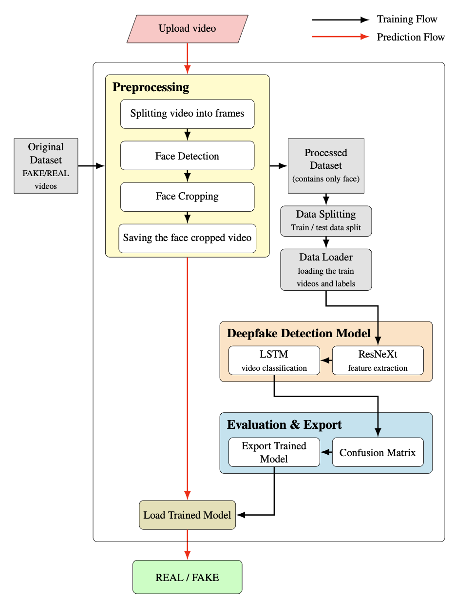
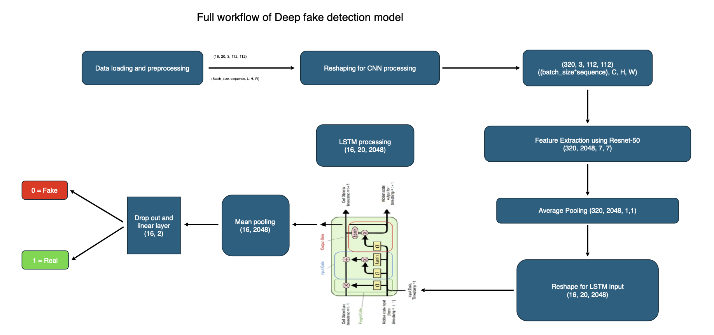

# 04-deepfake-detection
Educational projects and experiments on deepfake detection. This repo gathers exploratory demos, tests, and study notes inspired by the author's Big Data &amp; AI PhD preliminary studies, covering datasets, preprocessing, feature engineering, baselines, and evaluation workflows for video/face forgery detection.

# DeepFake Detection with ResNet-50 Features and Temporal Aggregation

> Educational, internal study on video-level DeepFake **detection** conducted at PwC. The goal is clarity and reproducibility, not chasing state-of-the-art scores.



## Overview
We build a transparent baseline that relies on two ingredients only:  
1) frame features extracted with a pre-trained **ResNet-50**,  
2) a light temporal aggregation stage that maps per-frame descriptors to a video-level decision.

Temporal aggregation is implemented with a compact **LSTM** for study purposes. As ablations, we consider simple mean pooling and majority voting. The focus is on data requirements, protocol choices, and limits to generalisation across sources. The workflow adapts a public reference pipeline that inspired the study:
- A. Jadhav, *Deepfake Video Detection Using Long Short-Term Memory*, <https://abhijithjadhav.medium.com/deepfake-video-detection-using-long-short-term-memory-df3674f83ecc>.

## Dataset and preprocessing
We assemble a custom corpus by merging three public sources:
- **FaceForensics++**: 2,115 clips  
- **DFDC**: 2,347 clips  
- **Celeb**: 1,989 clips  
**Total**: 6,452 videos (decompressed size ≈ 1.68 GB)

Each video is labeled as `REAL` or `FAKE` in `dataset/Global_metadata.csv`. The split is performed **at video level**: 60% train, 20% validation, 20% test, preserving class ratios.

Pipeline:
- decode videos to frames
- detect faces, crop tightly, resize to target resolution
- extract per-frame embeddings with **ResNet-50** (ImageNet pre-training, optional fine-tuning on face crops)
- aggregate per-frame descriptors to obtain a **video-level** decision

## Method
We compare:
- **Mean-pooling baseline**: average per-frame scores with a calibrated threshold
- **LSTM head**: feed ResNet-50 embeddings to a lightweight LSTM, then time-pool for the video logit

Training details:
- fixed random seeds
- early stopping on validation **ROC-AUC**
- light spatial augmentation on crops, simple temporal jitter
- we report **accuracy**, **AUC**, and **confusion matrices**, with notes on threshold effects at frame and video level



## Results, interpretation, and scope
Within-dataset, the LSTM head can match the mean-pooling baseline, while remaining sensitive to protocol choices and cross-dataset shifts. These observations reinforce the research direction that prioritises **generalisation** over raw in-dataset performance. Subsequent work focuses on **attribute-aware** training and evaluation rather than designing more complex temporal heads.

## Repository layout
04-deepfake-detection/
├─ .git/
├─ dataset/
│  ├─ all_videos/
│  ├─ face_only_data/
│  ├─ global_metadata.csv
│  └─ info.txt
├─ figs/
│  ├─ pipeline_resnet50_lstm.png
│  └─ system_architecture.png
├─ proj-01/
│  └─ deepfake_detection_on_custom_DataSet.ipynb
├─ proj-02/
│  ├─ checkpoint_model_deepfake/
│  ├─ deepfake_detection_LSTM_note.pdf
│  └─ deepfake_detection_LSTM.ipynb
├─ proj-03/
│  ├─ checkpoint_resnet_50/
│  └─ deepfake_detection_efficientnet_LSTM.ipynb
└─ README.md


## Notebooks in this repo
- **`proj-01/deepfake_detection_on_custom_DataSet.ipynb`**  
  End-to-end baseline on the merged dataset. Implements face-centric preprocessing, ResNet-50 feature extraction, and mean-pooling video decisions. Includes split creation, metrics, and confusion matrices.

- **`proj-02/deepfake_detection_LSTM.ipynb`**  
  Study variant that feeds ResNet-50 embeddings to a compact LSTM for temporal aggregation. Trains with early stopping on validation ROC-AUC, then compares against the mean-pooling baseline. Useful to inspect sensitivity to sequence length and thresholding.

- **`proj-03/deepfake_detection_efficientnet_LSTM.ipynb`**  
  Exploratory notebook that swaps the backbone to EfficientNet, keeping the LSTM head. Intended for comparing backbone capacity versus aggregation strategy under the same protocol.

## How to run
1. Place videos under `dataset/all_videos` or pre-extracted face crops under `dataset/face_only_data`.  
2. Provide labels in `dataset/global_metadata.csv` with columns: `video_path, label`.  
3. Open the notebooks in order, adjust paths and parameters in the configuration cells, run all cells.

**Requirements**: Python 3.x with common scientific stack (PyTorch and torchvision or equivalent, NumPy, OpenCV, pandas, scikit-learn). GPU support is recommended.

## Provenance and dissemination
The work and its intermediate findings were presented during **PwC “Tech Wednesday”**, 20 March 2024. The session prompted interest and questions from colleagues and helped align subsequent experimentation directions. Parts of the study are described in the author’s PhD thesis in **Big Data and Artificial Intelligence** at **Universitas Mercatorum**.

## License and notice
This repository is provided for educational purposes. Use of third-party datasets must respect their original licenses and terms.

---
*Keywords*: DeepFake detection, video classification, face crops, ResNet-50 features, temporal aggregation, LSTM, ROC-AUC, generalisation.

---
Privacy and reuse policy

* This repository contains code and model. No personal data are included.
* **Reuse is permitted provided that you cite the author and this work.**
* Recommended license: **Creative Commons Attribution 4.0 International (CC BY 4.0)**. You are free to share and adapt the material for any purpose, even commercially, as long as appropriate credit is given, a link to the license is provided, and any changes are indicated.

Short attribution text you can include in derivative works:

paper attribution
``` 
This material reuses data and methods from this paper:
Stile, V., Caldelli, R., Guerrero-Contreras, G., Balderas-Díaz, S., and Medina-Bulo, I. (2025). Analysis of DeepFake Detection through Semi-Supervised Facial Attribute Labeling. Proceedings of the 11th Spanish-German Symposium on Applied Computer Science (SGSOACS 2025), 2831, XX, 138, Wien, Austria. https://link.springer.com/book/9783032148155
© 2025 Vittorio Stile - Licensed under CC BY 4.0.
```

or Ph.D. thesis attribution
```
This material reuses data and methods from this Ph.D. Dissertation:
Stile, V. (2026). “AI-generated Deepfakes: Detection and Bias Analysis”. Ph.D. dissertation, Universitas Mercatorum, Roma, Italy.
© 2026 Vittorio Stile - Licensed under CC BY 4.0.
```

or GitHub repository attribution
```
This material reuses data and methods from this work:
Stile, V. (2025). Deepfake Attribute Detection – A Project on Attribute-Aware Detection and Bias Analysis. GitHub repository. https://github.com/vstile/deepfake-attribute-detection
© 2025 Vittorio Stile - Licensed under CC BY 4.0.
```
